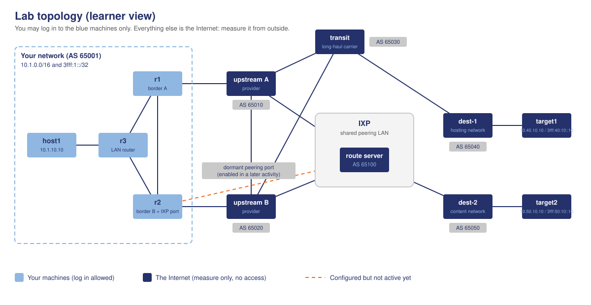

# Internet Measurements Lab

[](https://containerlab.dev/)
[](https://frrouting.org/)
[](https://www.rfc-editor.org/rfc/rfc9637)
[](https://github.com/features/codespaces)
[](https://academy.ripe.net/)

A dual-stack, multi-AS virtual network laboratory designed for the hands-on measurement activities in **Unit 2 of the RIPE NCC Internet Measurements course**. 

Learners operate their own Autonomous System (**AS 65001**) and measure external destinations across simulated transit networks, IXPs, and upstream providers. One persistent base topology powers every activity in the curriculum—fault scenarios and impairments are dynamically toggled via scripts without changing the network's shape.

---

## 🗺️ Lab Topology

Fourteen containers emulate seven Autonomous Systems plus an Internet Exchange Point (IXP):



> [!IMPORTANT]
> **The Observe-Only Rule:** You operate and log in to the **blue nodes in AS 65001** (`host1`, `r1`, `r2`, `r3`) and *only* those nodes. Every other network carries your traffic but remains closed to you. You observe, measure, diagnose, and build evidence from the outside—exactly like a real network operator.

---

## 📑 Table of Contents

- [🚀 Quick Start: Choose Your Route](#-quick-start-choose-your-route)
- [📋 Non-Technical Tester Setup Guide](docs/tester-setup-guide.md)
- [🖥️ The Interactive Control Portal](#️-the-interactive-control-portal)
- [🌐 Network Architecture & Addressing](#-network-architecture--addressing)
- [📚 Curriculum & Activities](#-curriculum--activities)
- [🛠️ Essential Commands & Scripts](#️-essential-commands--scripts)
- [🔍 Target Addresses & DNS Reference](#-target-addresses--dns-reference)
- [⚙️ Installer Internals & Platform Notes](#-installer-internals--platform-notes)
- [🔧 Maintainer Guide](#-maintainer-guide)

---

## 🚀 Quick Start: Choose Your Route

> [!TIP]
> **Testing this lab or not familiar with Git & CLI?** Check out our step-by-step **[Non-Technical Tester Setup Guide](docs/tester-setup-guide.md)** for a beginner-friendly walkthrough with direct ZIP download links and simple copy-paste commands.

Select the deployment method that fits your environment:

| Route | Best For | Host Prerequisites | Action / Command |
|---|---|---|---|
| ☁️ **GitHub Codespaces** | Quickest start, no local setup | Web browser only | [Open in Codespaces](https://github.com/features/codespaces) |
| 📦 **Pre-built VM Appliance** | Offline workshops, zero container install | VirtualBox, VMware, or UTM | Import OVA / QCOW2 image |
| ⚡ **One-Command Script** | macOS, Linux, or Windows WSL2 | Podman/Docker (or Homebrew on macOS) | `./install.sh` or `.\install.ps1` |
| 🐳 **VS Code Dev Container** | Local VS Code workflow | Docker Desktop + VS Code | Reopen in Dev Container |
| 🐧 **Native Linux Manual** | Custom Linux setups | Podman + Containerlab | `sudo ./lab.sh up` |

<details>
<summary><strong>Click to view detailed setup steps for each route</strong></summary>

### Route 1: GitHub Codespaces (Recommended for Courses)
1. Fork or open this repository on GitHub.
2. Click the green **Code** button, select the **Codespaces** tab, and click **Create codespace on main**.
3. A cloud container opens with Docker, Containerlab, and all dependencies pre-configured. GitHub's free allowance (120 core-hours/month) comfortably covers the entire unit.
4. Run `./portal.sh` in the integrated terminal to launch the interactive portal.

### Route 2: Pre-packaged Virtual Machine Appliance (Offline & Zero Host Setup)
Ideal for training venues with restrictive firewalls or learners who prefer not to install container software:
* **Windows / Linux / Intel Mac:** Import `measlab-x86_64.ova` into VirtualBox ([VirtualBox Setup Guide](docs/vm-guide-windows-virtualbox.md)) or VMware ([VMware Guide](docs/vm-guide-vmware.md)).
* **Apple Silicon Mac (M1–M4):** Open `measlab-arm64.qcow2` in UTM ([macOS UTM Guide](docs/vm-guide-mac-utm.md)).
* **Maintainers:** Automated VM build recipes are located in [`packer/README.md`](packer/README.md).

Once booted, the VM automatically deploys the lab and starts the Control Portal. Navigate to `http://localhost:8080` in your host browser.

### Route 3: One-Command Local Script
Clone the repository, open a terminal, and run:
* **macOS or native Linux:**
  ```bash
  ./install.sh
  ```
  *(On macOS, [Homebrew](https://brew.sh) is required to install Podman and ttyd; the script will automatically detect it or prompt to install it if missing).*
* **Windows (PowerShell):**
  ```powershell
  .\install.ps1
  ```
*(Sets up WSL2 if needed, installs dependencies, deploys the lab, and prepares the portal. For a beginner-friendly walkthrough with screenshots and direct ZIP download, see the [Non-Technical Tester Setup Guide](docs/tester-setup-guide.md)).*

### Route 4: Local VS Code Dev Container
Open the cloned repository folder in VS Code. When prompted with *"Reopen in Container"*, accept. The `.devcontainer/` specification builds directly from Containerlab's official image.

### Route 5: Native Linux Manual Setup
Requires Podman/Docker, Containerlab >= 0.60, `ttyd`, and Python 3:
```bash
sudo ./lab.sh up
./portal.sh
```

</details>

---

## 🖥️ The Interactive Control Portal

The lab features a web-based **Control Portal** that eliminates the need to run manual container commands:

1. Launch the portal server from the host terminal:
   ```bash
   ./portal.sh
   ```
2. Open **`http://localhost:8080`** in any web browser.

### Portal Features
* **Live In-Browser Terminals:** Side-by-side terminal tabs directly attached to your four accessible nodes (`host1`, `r1`, `r2`, `r3`) via `ttyd`.
* **Lab Lifecycle Buttons:** One-click triggers for `Start lab (up)`, `Health check`, `Reset to base state`, and `Stop lab (down)`.
* **Scenario Controls:** Toggle link congestion, IXP peering, and fault scenarios (1, 2, and 3) on the fly.
* **Continuous Measurement Logger:** Start and inspect live time-series CSV latency/loss measurements directly from the UI.
* **Integrated Looking Glass:** Submit read-only BGP diagnostic queries to upstream and transit routers without violating the observe-only boundary.
* **Persistent Progress & Notes:** Built-in scratchpad and task completion checkboxes stored in browser `localStorage`.

> [!TIP]
> The documentation and task sheets can also be viewed statically without the background portal server by running `sudo ./lab.sh docs` or directly opening `frontend/index.html`.

---

## 🌐 Network Architecture & Addressing

### Autonomous Systems Breakdown

| AS Number | Network Name | Role | IPv4 Allocation | IPv6 Allocation ([RFC 9637](https://www.rfc-editor.org/rfc/rfc9637)) | Nodes |
|---|---|---|---|---|---|
| **AS 65001** | **Learner Network** | Your enterprise AS | `10.1.0.0/16` | `3fff:1::/32` | `host1`, `r1`, `r2`, `r3` |
| **AS 65010** | Upstream A | Primary ISP (at IXP) | `10.10.0.0/16` | `3fff:10::/32` | `ra`, `ct1` (cross-traffic) |
| **AS 65020** | Upstream B | Secondary ISP (at IXP) | `10.20.0.0/16` | `3fff:20::/32` | `rb` |
| **AS 65030** | Transit Carrier | Long-haul backbone | `10.30.0.0/16` | `3fff:30::/32` | `rt` (impaired transit) |
| **AS 65040** | Dest-1 | Remote hosting provider | `10.40.0.0/16` | `3fff:40::/32` | `rd1`, `target1` |
| **AS 65050** | Dest-2 | Content provider | `10.50.0.0/16` | `3fff:50::/32` | `rd2`, `target2` |
| **AS 65100** | IXP Peering LAN | Shared route server | `100.64.99.0/24` | `3fff:ff::/64` | `route-server` (bridge) |

* **Point-to-Point Links:** Inter-AS links use `100.64.0.0/10` (IPv4) and `/64` subnets carved from each AS's `/32` (IPv6).
* **Routing Protocols:** All routers run [FRRouting](https://frrouting.org/). Interior routing uses OSPFv2, OSPFv3, and iBGP. External connections run per-family eBGP sessions with realistic route-filtering policies.

---

## 📚 Curriculum & Activities

The curriculum advances from fundamental active measurements to complex, multi-variable incident investigations. Task sheets live in [`activities/`](activities/) and are mirrored in the portal:

| # | Activity | Core Topics | Type | Key Scripts | Estimated Time |
|:---:|---|---|:---:|---|:---:|
| **1** | [Measure the Path](activities/activity1-measure-the-path.md) | `ping`, `traceroute`, `mtr`, BGP routing tables | Guided | *None* | 30–40 min |
| **2** | [When the Path Gets Busy](activities/activity2-when-the-path-gets-busy.md) | Queueing delay, bufferbloat, jitter, loss | Guided | `congestion.sh`, `logger.sh` | 30 min |
| **3** | [Turn On Peering](activities/activity3-turn-on-peering.md) | IXP peering, route servers, latency comparison | Guided | `peering.sh` | 25 min |
| **4** | [The Slow Neighbour](activities/activity4-scenario-slow-neighbour.md) | Troubleshooting routing detours (*tromboning*) | Scenario | `scenario.sh 1`, `lg.sh` | 30–40 min |
| **5** | [Now You See It, Now You Don't](activities/activity5-scenario-flapping-route.md) | Diagnosing intermittent link flaps & route damping | Scenario | `scenario.sh 2`, `lg.sh` | 30 min |
| **6** | [Double Trouble (Stretch)](activities/activity6-scenario-double-trouble.md) | Disentangling concurrent multi-variable incidents | Scenario | `scenario.sh 3`, `lg.sh` | 35–45 min |

For curriculum alignment with course modules, consult the [Activities Overview](activities/overview.md).

---

## 🛠️ Essential Commands & Scripts

### 1. Lab Lifecycle
Execute from the repository root:
```bash
./lab.sh up       # Deploy topology, apply impairments, verify BGP health
./lab.sh check    # Verify reachability, DNS, and latency tolerances
./lab.sh reset    # Clear faults, peering, and congestion back to base state
./lab.sh down     # Stop and tear down all lab containers
./lab.sh update   # Pull latest repo updates & refresh lab (or run ./update.sh)
```
*(On Linux/WSL2, prefix with `sudo` if running without rootless container permissions; on macOS, `./lab.sh` routes into the Podman VM automatically).*

### 2. Scenario & Simulation Scripts
```bash
# Toggle background cross-traffic on the rate-limited transit link
./scripts/congestion.sh start|stop|status

# Start background CSV time-series logger (writes to measurements.csv)
./scripts/logger.sh start|stop|status|dump

# Connect / disconnect AS 65001 at the IXP route server
./scripts/peering.sh up|down|status

# Learner-facing fault scenario triggers (neutral output)
./scripts/scenario.sh 1 on|off   # Scenario 1: Path detour / trombone
./scripts/scenario.sh 2 on|off   # Scenario 2: Flapping BGP session
./scripts/scenario.sh 3 on|off   # Scenario 3: Double Trouble (concurrent faults)

# Read-only Looking Glass into external routers
./scripts/lg.sh upstream-a "show bgp ipv4 unicast"
./scripts/lg.sh transit "show bgp summary"
./scripts/lg.sh route-server "show bgp summary"
```

### 3. Measurement & Probing One-Liners
Run from inside `host1` (`podman exec -it clab-measlab-host1 bash` or via the web terminal):

```bash
# Dual-stack reachability and latency
ping -c 10 target1.measlab
ping -c 10 -6 target2.measlab

# Multi-hop path and AS tracing
traceroute -n target1.measlab
traceroute -n -6 target2.measlab

# Real-time loss, latency, and jitter summary
mtr -n --report --report-cycles 50 target1.measlab

# High-frequency sampling & percentile computation (p50, p95, min, max)
ping -c 100 -i 0.2 target1.measlab | grep -oE 'time=[0-9.]+' | cut -d= -f2 > rtt.txt
sort -n rtt.txt | awk '{a[NR]=$1; s+=$1} END {print "Count:", NR, "Mean:", s/NR, "Median:", a[int((NR+1)/2)], "p95:", a[int(NR*0.95)], "Min:", a[1], "Max:", a[NR]}'
```

---

## 🔍 Target Addresses & DNS Reference

All containers resolve forward and reverse DNS records locally via the integrated dual-stack `dnsmasq` service:

| Machine Name | FQDN | IPv4 Address | IPv6 Address | Belonging Network |
|---|---|---|---|---|
| **host1 (Workstation)** | `host1.measlab` | `10.1.10.10` | `3fff:1:10::10` | AS 65001 (Learner) |
| **r3 (LAN Gateway)** | `r3.measlab` | `10.1.10.1` | `3fff:1:10::1` | AS 65001 (Learner) |
| **r1 (Border Router A)** | `r1.measlab` | `10.1.1.1` | `3fff:1:0:1::1` | AS 65001 (Learner) |
| **r2 (Border Router B)** | `r2.measlab` | `10.1.2.1` | `3fff:1:0:2::1` | AS 65001 (Learner) |
| **upstream A** | `ra.measlab` | `100.64.11.1` | `3fff:10:0:11::1` | AS 65010 |
| **transit** | `rt.measlab` | `100.64.13.2` | `3fff:30:0:13::2` | AS 65030 |
| **dest-1 Router** | `rd1.measlab` | `100.64.34.2` | `3fff:30:0:34::2` | AS 65040 |
| **target1 (Destination 1)** | `target1.measlab` | `10.40.10.10` | `3fff:40:10::10` | AS 65040 |
| **dest-2 Router (IXP)** | `rd2.measlab` | `100.64.99.50` | `3fff:ff::50` | AS 65050 |
| **target2 (Destination 2)** | `target2.measlab` | `10.50.10.10` | `3fff:50:10::10` | AS 65050 |

---

## ⚙️ Installer Internals & Platform Notes

The automated installer (`install.sh` / `install.ps1`) configures your system environment:
* **macOS:** Darwin lacks a native Linux kernel. The installer automatically spins up a rootful Linux VM via `podman machine` (4 vCPUs, 4 GiB RAM), installs Containerlab inside it, and configures port forwarding.
* **Linux / WSL2:** Podman, Containerlab, and `ttyd` install directly onto the host system via native package managers (`apt`, `dnf`, `pacman`) with automatic binary fallbacks.
* **Environment Marker (`.measlab/runtime.env`):** Created during installation to notify `lab.sh`, `portal.sh`, and `frontend/portal_server.py` whether commands run directly or route through `podman machine ssh`.

### System Requirements
* **RAM:** Minimum 4 GiB dedicated to the container engine.
* **Container Engine:** Docker Engine or Podman (default CLI configurations target Podman).
* **Containerlab:** Version 0.60.0 or higher.
* **Control Portal:** `ttyd` and Python 3.

---

## 🔧 Maintainer Guide

* **Ground Truth Impairments:** Emulated link conditions (latencies, jitter, packet loss, bandwidth caps) are declared in [`scripts/impairments.sh`](scripts/impairments.sh). If any value is modified, verify that model answers in [`activities/`](activities/) match.
* **Health Verification:** Run `./scripts/lab-check.sh` after any configuration change to ensure all 21 synthetic checks pass.
* **Modifying Documentation & Frontend:** Markdown files under `activities/*.md` and `frontend/pages/*.md` are the single source of truth. After editing, rebuild the standalone bundle:
  ```bash
  python3 frontend/build.py
  ```
* **Adding New Scenarios:** Implement fault scripts in `scripts/scenarios/`, register a neutral toggle in `scripts/scenario.sh`, and add corresponding portal buttons in `frontend/build.py`.

---

### Platform Testing Status & Notes
* **macOS (Podman machine path):** Tested end-to-end, including a real browser session against the Control Portal (buttons, side-by-side terminals, reconnect/pop-out).
* **Native Linux / WSL2 path:** Tested end-to-end on fresh Ubuntu 22.04 VMs (deploy, `lab-check.sh` 21/21 pass, Control Portal, idempotent reruns).
* **Windows (`install.ps1` WSL2 bootstrap):** Syntax-checked and verified under PowerShell Core on macOS with validated error handling. The initial `wsl --install` reboot cycle should be validated before running in a Windows-heavy workshop cohort.
* **Topology Figure:** `topology-diagram.svg` is the learner version; by design, it conceals impairments, the cross-traffic generator (`ct1`), and dormant peering ports.

---

## 📄 License & Attribution

Developed for the **RIPE NCC Academy** Internet Measurements curriculum. All topology manifests, router configurations, scenario scripts, and activity materials are original works.
