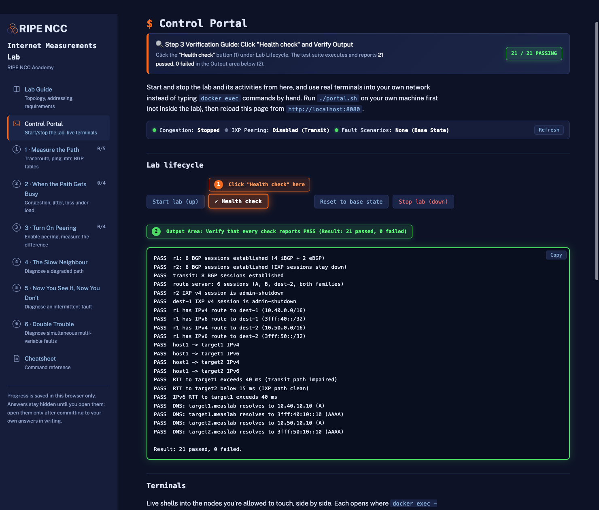
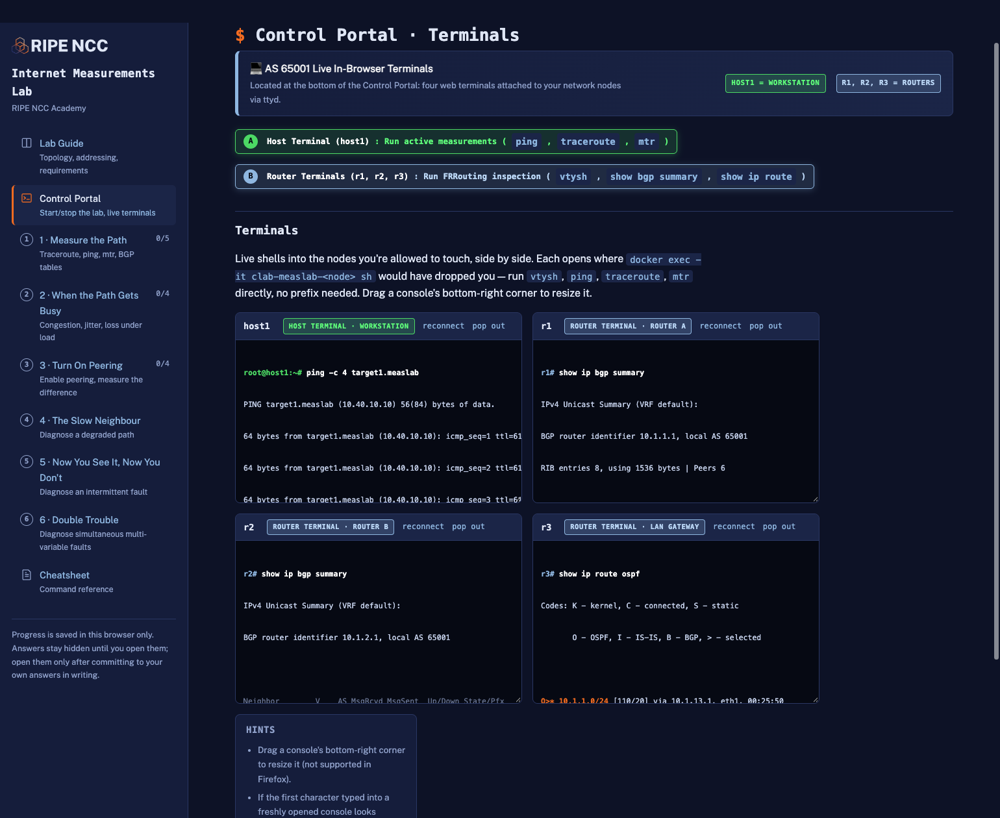

# Tester Setup Guide: Internet Measurements Lab

Hello and thank you for helping test the **Internet Measurements Lab**!

We are preparing this hands-on lab environment for learners in the **RIPE NCC Academy Internet Measurements course**. Before rolling it out, we need to verify that the automated installer and web portal work smoothly across different laptop models and operating systems (Windows, macOS, and Linux).

**You do not need to know Git or advanced networking to test this.** Everything runs through an automated script and an interactive browser-based dashboard.

---

## 📋 System Requirements
- **Laptop Operating System:** Windows 10/11, macOS (Intel or Apple Silicon M1–M4), or Linux.
- **Memory (RAM):** At least 4 GB of available RAM.
- **Disk Space:** Around 5 GB of free disk space (for the container images and networking tools).
- **Time Required:** 15–20 minutes to install and verify.
- **macOS Users:** Requires [Homebrew](https://brew.sh) package manager (instructions included below if you do not have it yet).

---

## Step 1: Download & Extract the Lab (No Git Required)

1. Click here to download the complete lab package:  
   👉 **[Download measurement-lab-main.zip](https://github.com/gviviers-droid/measurement-lab/archive/refs/heads/main.zip)**  
   *(Alternative: Visit [github.com/gviviers-droid/measurement-lab](https://github.com/gviviers-droid/measurement-lab), click the green **Code** button, and select **Download ZIP**).*
2. Locate the downloaded file in your `Downloads` folder.
3. **Extract / Unzip** the file:
   - **Windows:** Right-click `measurement-lab-main.zip` $\to$ **Extract All...** $\to$ Click **Extract**.
   - **macOS:** Double-click `measurement-lab-main.zip` to unzip it.
   - **Linux:** Right-click and choose **Extract Here** or run `unzip measurement-lab-main.zip`.

---

## Step 2: Run the Installer for Your Operating System

Open the extracted `measurement-lab-main` folder and follow the instructions for your platform below:

### 🪟 Windows (Windows 10 or 11)

1. Open the extracted folder `measurement-lab-main`.
2. Hold down the **Shift** key and **right-click** on empty space inside the folder window.
3. Select **Open in Terminal** (or **Open PowerShell window here**).
4. Run the installer script:
   ```powershell
   .\install.ps1
   ```
   > ℹ️ **First-time WSL Setup:** If your machine does not already have Windows Subsystem for Linux (WSL2), the script will automatically install it. Windows may prompt you to reboot your laptop. If it does, reboot, open the same folder in PowerShell again, and re-run `.\install.ps1`.

5. Once the installation script finishes, launch the portal:
   ```powershell
   wsl
   ./portal.sh
   ```

---

### 🍎 macOS (Apple Silicon M1–M4 or Intel)

> [!IMPORTANT]
> **Prerequisite: Homebrew**  
> macOS requires **[Homebrew](https://brew.sh)** to automatically install the container and terminal tools (`podman` and `ttyd`).
> 
> - **If you already have Homebrew:** You can skip straight to Step 1 below.
> - **If you don't have Homebrew (or aren't sure):** Open Terminal and copy-paste this one command first:
>   ```bash
>   /bin/bash -c "$(curl -fsSL https://raw.githubusercontent.com/Homebrew/install/HEAD/install.sh)"
>   ```
>   *(Press `Enter` when prompted and enter your Mac password. If you are on an Apple Silicon Mac M1–M4, follow any "Next steps" commands shown, though our installer script will also auto-detect it).*

1. Open the **Terminal** application (press `Cmd + Space`, type `Terminal`, and hit `Enter`).
2. Navigate to the extracted lab folder:
   ```bash
   cd ~/Downloads/measurement-lab-main
   ```
   *(Alternatively: type `cd ` followed by a space, then drag and drop the extracted `measurement-lab-main` folder from Finder into the Terminal window and hit `Enter`).*
3. Run the installer:
   ```bash
   ./install.sh
   ```
   *(If prompted, enter your Mac administrator password to allow the installer to configure network permissions).*
4. Once the installer finishes, launch the portal:
   ```bash
   ./portal.sh
   ```

---

### 🐧 Linux (Ubuntu, Debian, Fedora, Arch, etc.)

1. Open a terminal inside the extracted `measurement-lab-main` folder.
2. Run the installer:
   ```bash
   ./install.sh
   ```
3. Once completed, start the portal:
   ```bash
   ./portal.sh
   ```

---

## Step 3: Open the Web Portal & Verify

1. Open your web browser (Chrome, Edge, Firefox, or Safari) and go to:  
   👉 **[http://localhost:8080](http://localhost:8080)**
2. You should see the **Internet Measurements Lab Control Portal**.
3. Check the following:
   - [ ] Does the page load cleanly?
   - [ ] Click the **"Health check"** button (under **Lab lifecycle**) — does the Output area report `Result: 21 passed, 0 failed`?
   - [ ] Do the live terminal panes appear at the bottom for `host1`, `r1`, `r2`, and `r3`?
   - [ ] Can you see the task sheets on the left panel (Activity 1 to Activity 6)?

### 1. Where to Click "Health check" & Verify Results

Under the **Lab lifecycle** section, click the **"Health check"** button (labelled **1** below). The automated test suite will run and report the results in the **Output Area** (labelled **2** below). Every line should report `PASS`, ending with `Result: 21 passed, 0 failed`:



---

### 2. Where the Router & Host Terminals are Located

Scroll down to the **Terminals** section at the bottom of the dashboard. Four side-by-side terminal shells connect you directly to your network nodes (**AS 65001**) without needing manual container commands:

* **Host Terminal (`host1`)** (labelled **A** below): The learner workstation shell. Use this for active measurement commands (`ping`, `traceroute`, `mtr`).
* **Router Terminals (`r1`, `r2`, `r3`)** (labelled **B** below): The routing engine shells. Use these for FRRouting diagnostics (`vtysh`, `show ip bgp summary`, `show ip route`).



If all of these pass and connect, your setup is completely successful! 🎉

---

## Step 4: Shutting Down When Done

1. In the terminal window running `./portal.sh`, press **`Ctrl + C`** to stop the web server and terminals.
2. To stop the virtual network containers and free up memory:
   ```bash
   ./lab.sh down
   ```
   *(On Windows WSL2 / Linux, run with `sudo ./lab.sh down` if needed).*

---

## 🔄 How to Upgrade to the Latest Version

If new activities, exercises, or fixes are published to the repository, you can update your existing installation in one command without starting over:

1. Open your terminal in your `measurement-lab-main` folder.
2. Run the update script:
   - **macOS / Linux:**
     ```bash
     ./update.sh
     ```
   - **Windows (PowerShell):**
     ```powershell
     .\update.ps1
     ```
   *(This automatically downloads the latest updates whether you used Git or downloaded the ZIP. If you cloned with Git, running `git pull` works too).*
3. Restart the portal:
   - If `./portal.sh` is currently running, press **`Ctrl + C`** in its terminal and restart it with `./portal.sh`.
   - Refresh your browser at **`http://localhost:8080`**.

> [!TIP]
> **Your progress is preserved:** All checked tasks and scratchpad notes in the web portal are stored in your browser's local storage (`localStorage`). Updating the lab files will **not** wipe your completed tasks or notes!

---

## 🗑️ How to Completely Uninstall the Lab

When you have finished testing or completed the course and want to cleanly remove the lab and reclaim disk space and RAM:

1. Open your terminal inside your `measurement-lab-main` folder.
2. Run the clean uninstaller:
   - **macOS / Linux:**
     ```bash
     ./uninstall.sh
     ```
   - **Windows (PowerShell):**
     ```powershell
     .\uninstall.ps1
     ```
3. The uninstaller will safely:
   - Stop running portal servers and terminals.
   - Tear down all 14 virtual network containers and bridges.
   - Reclaim ~3–5 GB of disk space by clearing container images and temporary runtime files.
   - **On macOS:** Stop and remove the `podman-machine-default` VM, immediately freeing 4 GB of dedicated RAM and 5–10 GB of disk space.
4. You can then safely delete the downloaded `measurement-lab-main` folder from your computer.

---

## 📝 Feedback We Need From You

Please reply to this email with a quick note answering:
1. **What is your OS?** (e.g. Windows 11 Home, macOS Sonoma on M2 Mac, Ubuntu 22.04)
2. **Did the installation complete without errors?** If any error occurred, what did it say?
3. **Did the dashboard at `http://localhost:8080` load and connect to the terminals?**
4. **Any confusing steps or suggestions to improve the guide?**

Thank you very much for your time and help!
